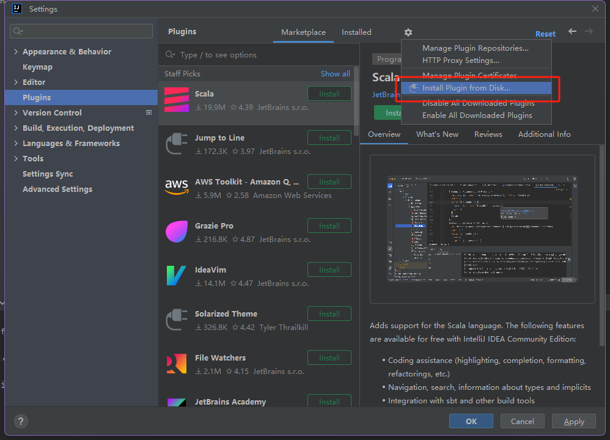
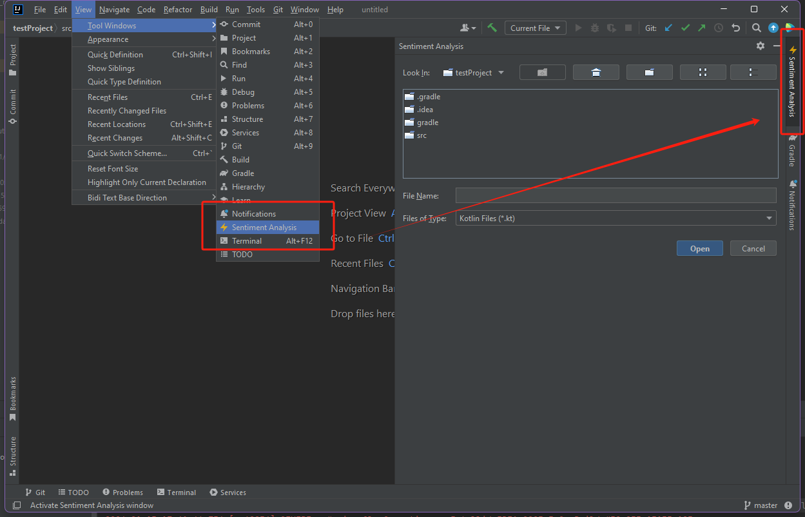
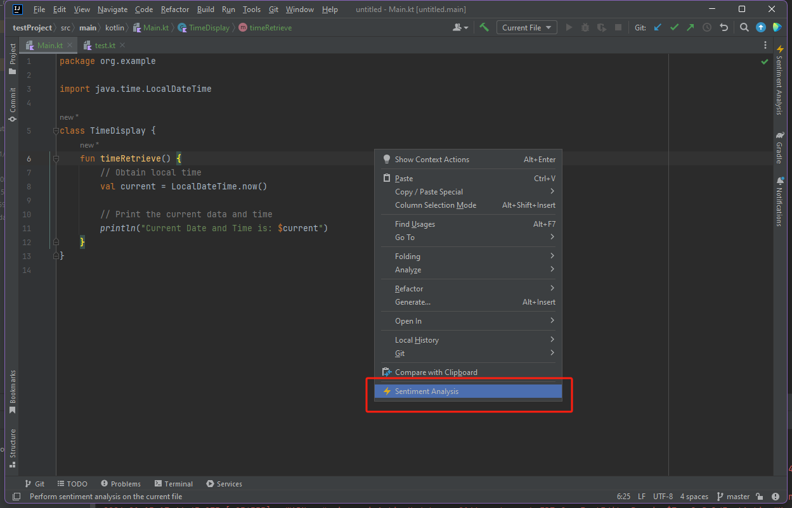
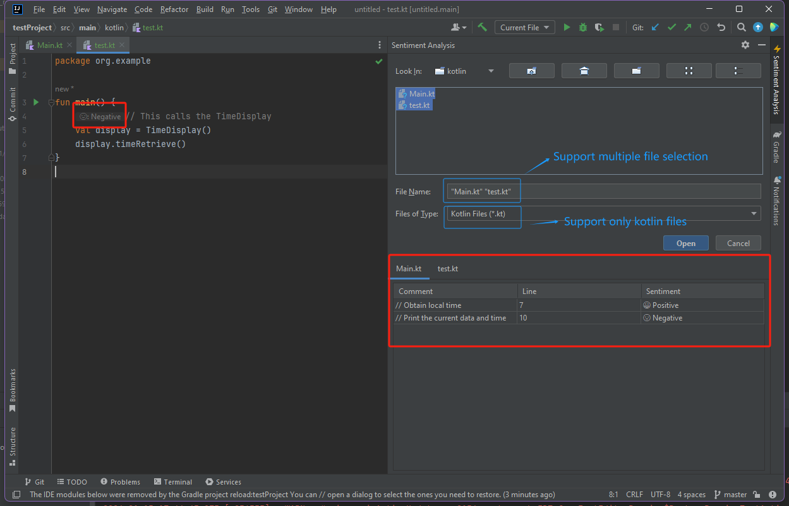

# Comment Sentiment Analyzer Plugin

## Overview

**Comment Sentiment Analyzer** is a plugin for IntelliJ IDEA platform that performs binary sentiment classification on comments from Kotlin files. 
The source code of the plugin can be found at [Plugin Source Code][gh:sourcecode].

[gh:sourcecode]: https://github.com/d-lu-19/sa_roberta


This README will cover the following content:
<!-- TOC -->
* [Comment Sentiment Analyzer Plugin](#comment-sentiment-analyzer-plugin)
  * [Overview](#overview)
  * [Plugin Setup](#plugin-setup)
  * [Main Features](#main-features)
    * [1. Plugin Entries](#1-plugin-entries)
    * [2. File Selection](#2-file-selection)
    * [3. Sentiment Analysis Statistics Display](#3-sentiment-analysis-statistics-display)
  * [Contact](#contact)
<!-- TOC -->

---

## Plugin Setup

1. Clone `TestProject` from repo (contains 2 Kotlin classes and 1 Java class);
   ```sh
   git clone https://github.com/d-lu-19/CommentSentimentAnalyzer.git
   ```
2. Download the built plugin file `sa_roberta-0.0.1.zip` from [here][gh:link];

3. Navigate to `File > Settings > Plugins`;

3. Click `Install Plugin from Disk...`;



4. Choose `sa_roberta-0.0.1.zip` . This should install the plugin. Ensure that the plugin CommentSentimentAnalyzer is **enabled** after installation;

5. Open `TestProject` or any Kotlin project in Intellij IDEA (I use 2023.3.2) and you can start exploring the plugin 🙂

[gh:link]: https://drive.google.com/file/d/1b8vs2v1SUokl8oVvjeybs7ZdY9ZK2MJ8/view?usp=sharing

--- 

## Main Features

This section provides illustrations on the main features of the plugin.

### 1. Plugin Entries

**Option 1**: Click `View > Tool Window > Sentiment Analysis`, this will open the plugin window on the right




**Option 2**: If you already have a Kotlin file open in the editor, right-click on the file, click `Sentiment Analysis`. This will
initiate comment sentiment analysis on the current file. Please note that only Kotlin file type is supported.




### 2. File Selection
Select kotlin file(s) in the file chooser and confirm performing comment sentiment analysis on the selected file(s).

Note that The default path of the file chooser is set to the root of current project and the file type is filtered to Kotlin files.

### 3. Sentiment Analysis Statistics Display
The sentiment statistics of comments will be displayed through
- Inlay hints aligned to the comment
- Statistics table(s) on the plugin window, each tab contain statistics for one selected file




---

## Contact
**📧Email**: ludongxu.9@gmail.com


